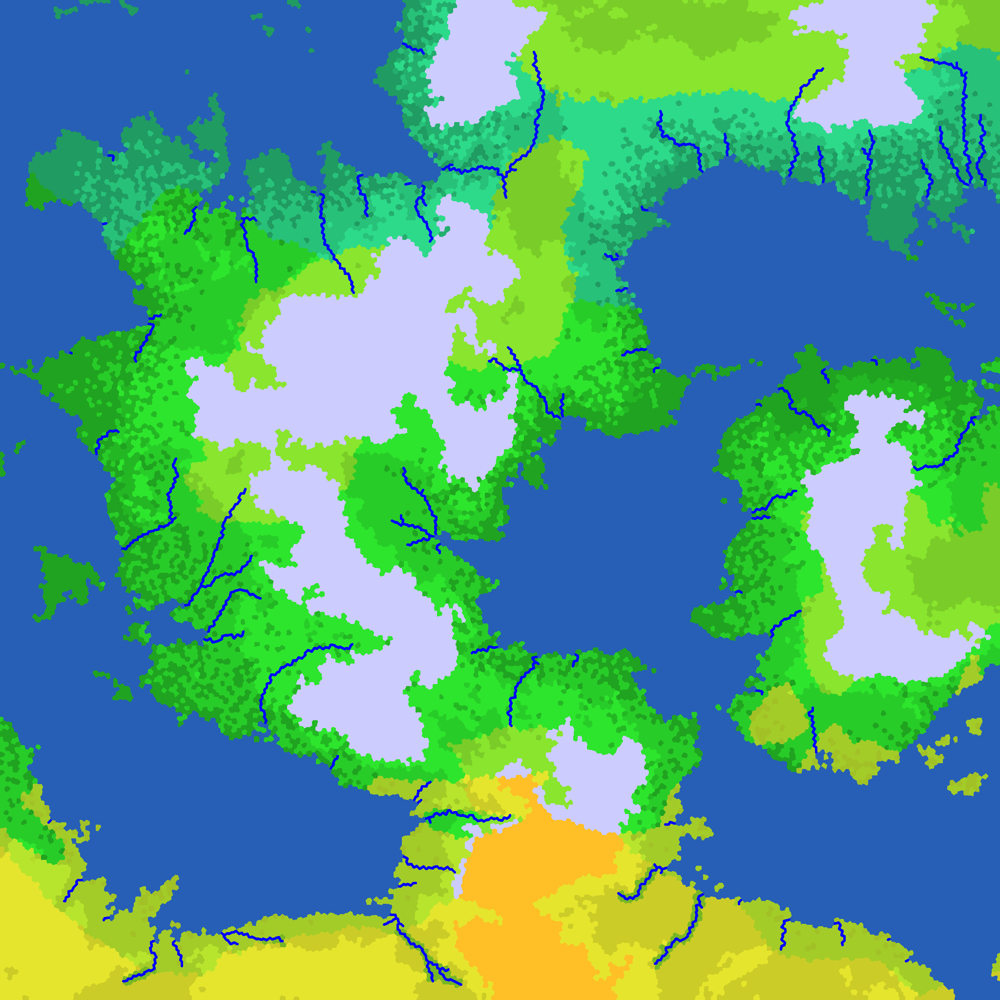

# worldgen
Random Constructed World (Conworld) generator.
Based on a single seed it generates landmasses, seas, mountains, rivers, etc.
The program outputs an image of the world.

## How to build
Simply run the Makefile

